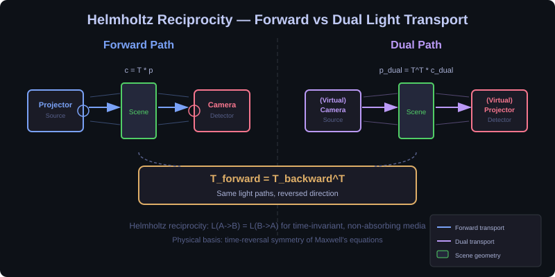
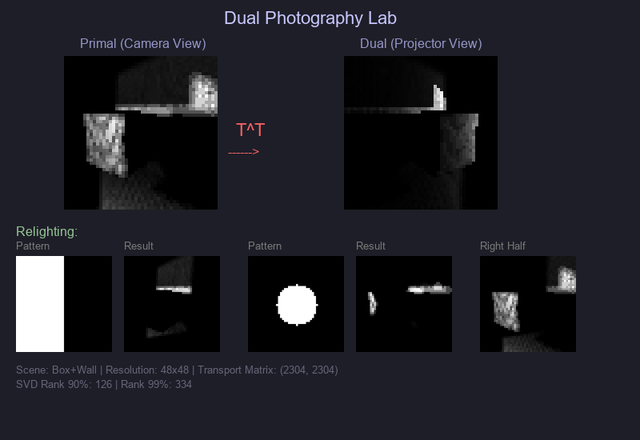
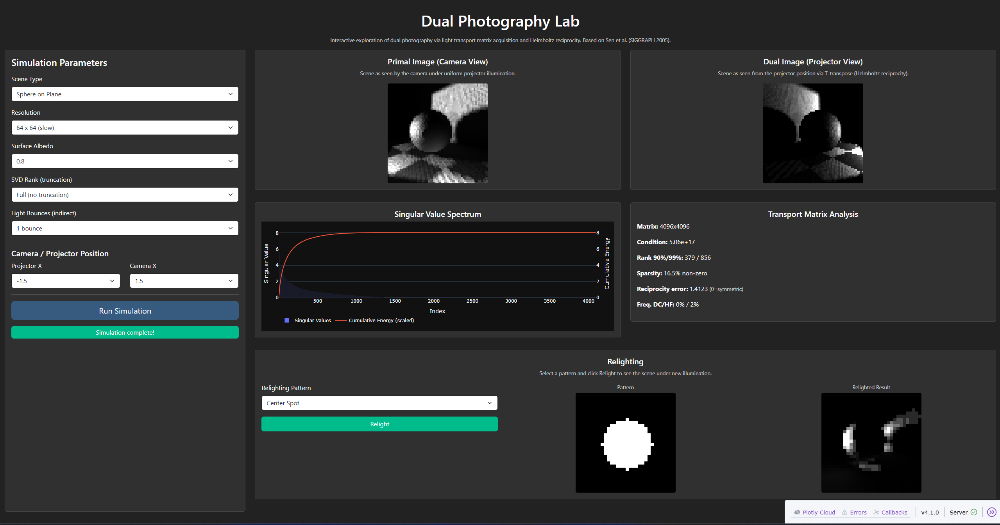
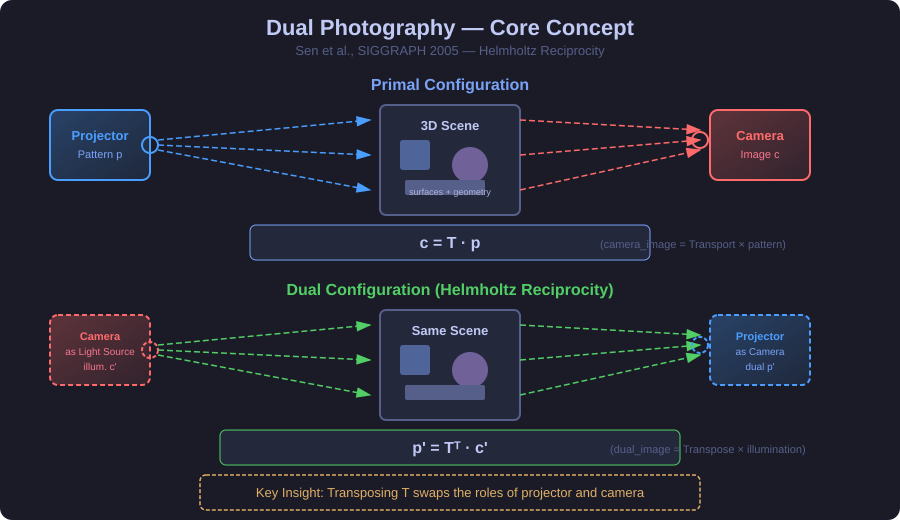
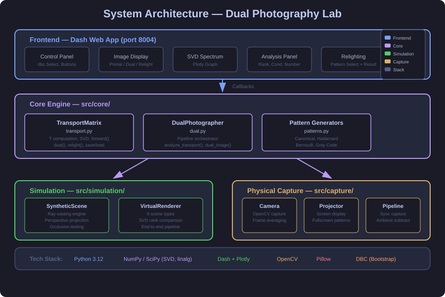

# Dual Photography Lab

Interactive application for **Dual Photography** — a computational imaging technique that reconstructs how a scene looks from a projector's viewpoint by exploiting **Helmholtz reciprocity** and the **light transport matrix**.

Based on the work by Sen et al. (SIGGRAPH 2005).

---

## Motivation & Problem

Dual photography exploits Helmholtz reciprocity: the light transport matrix T between projector and camera, transposed as T^T, lets us see through the projector's eyes. This enables virtual relighting and novel viewpoints from a single capture.



---

## KPIs — Impact & Value

| KPI | Impact |
|-----|--------|
| Novel imaging capability | See through the projector's eyes without moving the camera |
| Virtual relighting | Change illumination without re-capturing the scene |
| Spectral analysis | Multi-wavelength material characterization from single setup |
| Platform migration | MATLAB prototype → Python web app (no license required) |

## Demo



*Box+Wall scene at 48x48 resolution. Left: primal image (camera view). Right: dual image (projector view via T-transpose). Bottom: relighting with different illumination patterns.*

---

## Frontend



<video src="docs/videos/Sim_Working.mp4" controls width="100%"></video>

### Video Demo

[](https://youtu.be/Ju5GQuowxaE)

---

## Technical Approach — Light Transport Mathematics



When a projector illuminates a scene and a camera captures the result, the relationship is linear:

```
camera_image = T · projector_pattern
```

where **T** is the *light transport matrix*. By **Helmholtz reciprocity**, transposing T swaps the roles of projector and camera:

```
dual_image = T^T · virtual_illumination
```

This produces the scene as seen **from the projector's position** — without any additional hardware.

### Transport Matrix Acquisition

| Method | Patterns Needed | Quality | Speed |
|--------|----------------|---------|-------|
| Canonical (one-at-a-time) | N = p·q | Exact | Slow |
| Hadamard (multiplexed) | N = p·q | Optimal SNR | Medium |
| Bernoulli (compressed sensing) | N << p·q | Good | Fast |

### Key Equations

#### Primal Imaging — Camera Observes Projector Illumination
The camera image is a linear transformation of the projector pattern through the scene's light transport:

```
c = T · p
```

where **T** is the light transport matrix (size m x n, with m camera pixels and n projector pixels), **p** is the projected pattern, and **c** is the captured camera image. Each entry T_ij encodes how much light from projector pixel j reaches camera pixel i.

#### Dual Imaging — Seeing Through the Projector's Eyes
By Helmholtz reciprocity, transposing T swaps the roles of projector and camera:

```
p' = T^T · c'
```

where **T^T** is the transposed transport matrix and **c'** is a virtual illumination pattern applied from the camera's side. This produces the scene as seen from the projector's viewpoint — no additional hardware needed.

#### SVD Compression — Rank-k Approximation
The transport matrix is compressed via truncated singular value decomposition to reduce noise and storage:

```
T ≈ U_k · Σ_k · V_k^T
```

where **U_k** contains the k dominant camera-space modes, **Σ_k** holds the k largest singular values, and **V_k^T** holds the projector-space modes. Typical scenes have effective rank 10-50, meaning >99% of the energy is captured by far fewer modes than full resolution.

#### Virtual Relighting — New Illumination Without Re-Capture
Once T is known, any new illumination pattern can be applied computationally:

```
c_new = T · p_new
```

where **p_new** is an arbitrary virtual projector pattern. This enables real-time relighting of the captured scene without additional physical measurements.

---

## Architecture



---

## Features

- **Ray-Cast Simulation**: Compute transport matrices for 3D scenes with proper perspective projection, occlusion testing, and Lambertian BRDF — no physical hardware needed
- **6 Scene Types**: Box+Wall (occlusion demo), Sphere on Plane, Corner Room, Two Angled Planes, Cylinder with Text, Flat Textured Wall
- **SVD Analysis**: Visualize singular value spectrum, effective rank, condition number, and energy distribution
- **Dual Image Generation**: Compute the dual photograph via T-transpose — see the scene from the projector's viewpoint
- **Interactive Relighting**: Apply 10 different illumination patterns (left/right half, spot, stripes, random) and see the relighted scene instantly
- **Physical Capture** (optional): Acquire transport matrices using a webcam and screen-as-projector with ambient subtraction
- **Multiple Pattern Types**: Canonical, Hadamard, Bernoulli (compressed sensing), Gray code

## Project Metrics & Status

| Metric | Status |
|--------|--------|
| Tests | 165 passing |
| SVD reconstruction | Configurable rank-k with auto-truncation |
| Spectral channels | RGB (3-channel) transport matrices |
| Calibration | Gray code pattern generation + decoding |
| API endpoints | 11 REST endpoints |

---

## Quick Start

### 1. Install Dependencies

```bash
cd d:/_Repos/_SCIENCE/FASL_Coding_DualFotography
pip install -e ".[dev]"
```

### 2. Run the Web Application

```bash
python -m src.frontend.app
```

Open **http://127.0.0.1:8004** in your browser. Select a scene, click "Run Simulation".

### 3. Run Tests

```bash
pytest tests/ -v
```

70 tests covering core engine, simulation, and frontend callbacks.

---

## Project Structure

```
src/
├── core/              # Core dual photography engine
│   ├── patterns.py    # Illumination pattern generators (Hadamard, Bernoulli, etc.)
│   ├── transport.py   # Transport matrix: SVD, forward/dual/relight operations
│   └── dual.py        # High-level DualPhotographer orchestrator
├── simulation/        # Ray-cast 3D scene simulation
│   ├── scene.py       # Scene primitives, ray-casting, occlusion, texture mapping
│   └── renderer.py    # Virtual renderer pipeline
├── capture/           # Physical acquisition (optional hardware)
│   ├── camera.py      # Webcam capture via OpenCV
│   ├── projector.py   # Screen-based pattern projection
│   └── acquisition.py # Synchronized capture pipeline
└── frontend/          # Dash web application
    ├── app.py         # Dashboard with interactive controls
    └── assets/        # CSS styles

docs/
├── 01_technical_reference.md   # Mathematical foundations and algorithms
├── 02_user_guide.md            # How to use the application
├── 03_history.md               # Development history and changelog
├── 04_references.md            # Bibliography and references
├── svg/                        # Diagrams
│   ├── concept_dual_photography.svg
│   ├── architecture.svg
│   └── transport_matrix_theory.svg
└── img/                        # Generated demo images
```

---

## API Documentation

### REST Endpoints

| Method | Path | Description |
|--------|------|-------------|
| `GET` | `/api/health` | Health check |
| `GET` | `/api/log` | Retrieve processing log |
| `GET` | `/api/scenes` | List available scene types |
| `POST` | `/api/simulate` | Run full simulation (transport matrix + dual + SVD) |
| `POST` | `/api/relight` | Apply virtual relighting pattern |
| `GET` | `/api/svd` | Get SVD analysis (singular values, rank, condition) |
| `GET` | `/api/transport` | Get transport matrix metadata and visualization |
| `GET` | `/api/frequency` | Frequency-domain analysis of transport matrix |
| `POST` | `/api/spectral-simulate` | Run spectral (multi-wavelength) simulation |
| `POST` | `/api/spectral-relight` | Spectral relighting with per-channel control |
| `POST` | `/api/calibrate` | Calibrate physical capture parameters |

---

### Port

**8004** -- http://127.0.0.1:8004

---

## Documentation

See the [docs/](docs/) folder for:

- [Technical Reference](docs/01_technical_reference.md) — Mathematical foundations, ray-casting algorithm, scene types
- [User Guide](docs/02_user_guide.md) — Installation, usage, recommended experiments
- [Development History](docs/03_history.md) — Changelog and architectural decisions
- [References](docs/04_references.md) — Bibliography and related work
- [Transport Matrix Theory (SVG)](docs/svg/transport_matrix_theory.svg) — Visual explanation of T, SVD, and applications

---

## References

- Sen, P. et al. (2005). Dual Photography. *ACM SIGGRAPH 2005*.
- Helmholtz, H. von (1856). *Handbuch der physiologischen Optik*.
- Debevec, P. et al. (2000). Acquiring the reflectance field of a human face. *SIGGRAPH 2000*.
- Peers, P. et al. (2009). Compressive light transport sensing. *ACM TOG*, 28(1).

---

## License

MIT
