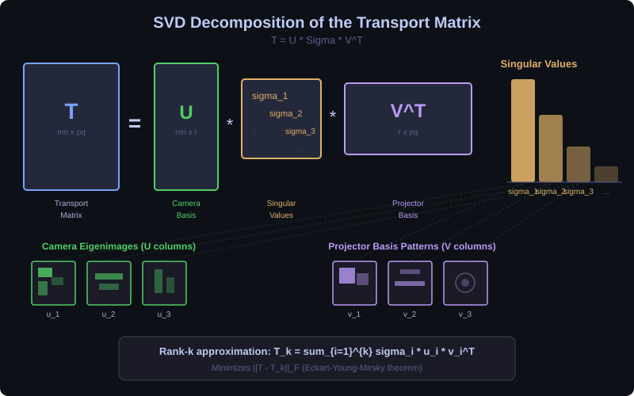

# Technical Reference — Dual Photography Lab

## 1. Problem Statement

In computational photography, we often want to see a scene from a viewpoint where no camera exists. Dual photography solves this by exploiting a fundamental symmetry of light: **if you know how light travels from A to B, you also know how it travels from B to A**.

Given a projector and a camera observing a scene, we measure the complete light transport relationship between them. By mathematically transposing this relationship, we synthesize what the scene looks like from the projector's position — as if the projector were a camera and the camera were a light source.

## 2. Mathematical Foundation

### 2.1 The Transport Matrix

Light transport through a fixed scene is linear. If we vectorize the projector pattern into a column vector **p** of size (pq × 1), where p and q are the projector's vertical and horizontal pixel counts, and the camera image into **c** of size (mn × 1), then:

```
c = T · p
```

The matrix **T** has dimensions (mn × pq). Each entry T[i,j] represents the total fraction of light energy emitted by projector pixel j that ultimately arrives at camera pixel i. This includes all possible transport paths through the scene: direct illumination, diffuse reflection, specular bounces, subsurface scattering, and any other optical phenomenon.

### 2.2 Helmholtz Reciprocity

The Bidirectional Reflectance Distribution Function (BRDF) of most natural materials satisfies a symmetry property:

```
f_r(ω_in, ω_out) = f_r(ω_out, ω_in)
```

This means swapping the incident and exitant light directions yields the same reflectance value. The physical basis is the time-reversal symmetry of electromagnetic wave propagation: Maxwell's equations are symmetric under time reversal in non-absorbing media.

This symmetry propagates to the transport matrix. If we define a "dual" configuration where the camera emits light and the projector acts as a sensor:

```
p_dual = T^T · c_dual
```

The transpose of T encodes the reverse light transport. The resulting image **p_dual** shows the scene as it would appear from the projector's position, illuminated from the camera's position.

### 2.3 SVD and Low-Rank Approximation

The transport matrix can be decomposed via Singular Value Decomposition:

```
T = U · Σ · V^T
```

where U contains the left singular vectors (camera-space basis), Σ is a diagonal matrix of singular values in descending order, and V^T contains the right singular vectors (projector-space basis).

Keeping only the top k singular values gives the best possible rank-k approximation (by the Eckart-Young-Mirsky theorem):

```
T_k = U_k · Σ_k · V_k^T
```

This serves two purposes:
1. **Compression**: storing U_k, Σ_k, V_k requires far less memory than the full T
2. **Denoising**: small singular values typically correspond to noise; truncating them improves signal quality

### 2.4 Acquisition Methods

The transport matrix can be measured by projecting known patterns and capturing the camera response:

| Method | Patterns Required | Strengths | Weaknesses |
|--------|------------------|-----------|------------|
| **Canonical** (one pixel at a time) | N = pq | Exact T, simple | Very slow |
| **Hadamard** (multiplexed) | N = pq | Best SNR per measurement | Requires power-of-2 size |
| **Bernoulli** (random binary) | N << pq | Fast acquisition, compressed sensing | Requires sparse recovery solver |
| **Gray code** (structured light) | N = 2·ceil(log₂(max(p,q))) | Establishes pixel correspondence | Assumes one-to-one mapping |

For the pseudoinverse method, given N pattern-capture pairs:
```
P = [p_1 | p_2 | ... | p_N]    (pq × N)
C = [c_1 | c_2 | ... | c_N]    (mn × N)
T = C · pinv(P)
```

## 3. Ray-Casting Transport Matrix Computation

Our simulation computes T analytically by ray-casting, avoiding the need for physical hardware.

### 3.1 Perspective Projection Model

Both projector and camera are modeled as pinhole devices. Each pixel (row, col) in a device with resolution (H, W) and field-of-view θ maps to a ray direction:

```
u = 2·(col + 0.5)/W - 1        (normalized horizontal coordinate)
v = 1 - 2·(row + 0.5)/H        (normalized vertical, flipped)

ray_direction = forward + u·right·tan(θ/2)·aspect + v·up·tan(θ/2)
```

where `forward`, `right`, `up` form the device's orthonormal basis, and `aspect = W/H`.

### 3.2 Scene Intersection

Rays are tested against all scene primitives (planes, bounded rectangles, spheres). For each ray, we find the nearest intersection and extract:
- Hit position
- Surface normal
- Albedo (scalar or texture-mapped)

### 3.3 Transport Entry Computation

For projector pixel j and camera pixel i:

1. Cast a ray from the projector through pixel j → find hit point P_j on the scene
2. Check what camera pixel i sees → find hit point C_i on the scene
3. If C_i ≈ P_j (within one projector pixel footprint):
   - Compute cos_in = max(0, normal · direction_to_projector)
   - Compute cos_out = max(0, normal · direction_to_camera)
   - Test visibility: cast a shadow ray from P_j to camera, check for occlusion
   - T[i,j] = albedo · cos_in · cos_out / distance²

### 3.4 Occlusion Testing

For each (projector→surface→camera) light path, a shadow ray is cast from the surface point toward the camera. If this ray hits another object before reaching the camera, the path is blocked and T[i,j] = 0. This is what creates the visual differences between primal and dual images in scenes with 3D geometry.

## 4. Scene Types

| Scene | Description | Why It's Interesting |
|-------|-------------|---------------------|
| **Box + Wall** | A cube in front of a textured wall | Occlusion: each viewpoint sees a different face of the box and different wall areas |
| **Sphere on Plane** | Sphere on a checkerboard floor | Curved geometry creates smooth parallax differences |
| **Corner Room** | Two walls at 90° with textures | Each viewpoint sees a different wall predominantly |
| **Two Angled Planes** | V-shaped planes with letters | Angled surfaces favor different viewpoints |
| **Cylinder with Text** | Polygon-approximated cylinder | Text appears mirrored between viewpoints |
| **Flat Textured Wall** | Single wall with letter "F" | Baseline: minimal viewpoint difference |

## 5. Implementation Notes

### 5.1 Normalization

The transport matrix is normalized so that max(T) = 1.0. This ensures consistent visualization regardless of absolute light energy levels.

### 5.2 Pixel Footprint Matching

When checking if camera pixel i "sees" the same point illuminated by projector pixel j, we use an adaptive threshold based on the projector's pixel footprint at the hit distance:

```
footprint = distance_to_surface · tan(FOV / n_pixels)
threshold = 1.5 · footprint
```

This accounts for the fact that projector pixels illuminate finite areas, not infinitesimal points.

### 5.3 Performance Considerations

The transport matrix computation is O(n_cam × n_proj × n_objects). For a 32×32 resolution with 8 objects, this is ~8 million ray-object tests — fast enough for interactive use. At 64×64, it takes a few seconds. The computation is CPU-bound and could be accelerated with NumPy vectorization or GPU ray-tracing.

## 6. Helmholtz Reciprocity Principle

Light transport is symmetric: the radiance from point A to point B equals that from B to A, provided the medium is time-invariant and non-absorbing. Formally:

```
L(A -> B) = L(B -> A)
```

This symmetry arises from the time-reversal invariance of Maxwell's equations. In the context of dual photography, it means that the forward transport matrix (projector-to-camera) is the transpose of the backward transport matrix (camera-to-projector):

```
T_forward = T_backward^T
```

This is the foundation of dual photography: measuring T in one direction gives you the complete transport in the reverse direction for free, simply by transposition. The principle holds for all materials whose BRDF satisfies f_r(omega_in, omega_out) = f_r(omega_out, omega_in), which includes Lambertian surfaces, Blinn-Phong models, and all physically plausible BRDFs based on microfacet theory.


## 7. SVD Interpretation

The Singular Value Decomposition of the transport matrix provides deep insight into the structure of light transport:

```
T = U * Sigma * V^T
```

Each component has a precise physical meaning:

- **U columns** (left singular vectors): Camera-space basis images, also called **eigenimages**. Each column u_i, when reshaped to the camera resolution, shows a fundamental spatial pattern that the camera can observe.
- **V columns** (right singular vectors): Projector-space basis patterns. Each column v_i, when reshaped to the projector resolution, shows a fundamental illumination pattern.
- **Sigma** (singular values): Importance weights sigma_1 >= sigma_2 >= ... >= sigma_r > 0. The magnitude of each singular value indicates how strongly the corresponding basis pattern-image pair contributes to the overall transport.

The rank-k approximation minimizes the Frobenius-norm error among all rank-k matrices:

```
T_k = sum_{i=1}^{k} sigma_i * u_i * v_i^T

||T - T_k||_F = sqrt(sum_{i=k+1}^{r} sigma_i^2)
```

This is the **Eckart-Young-Mirsky theorem**. In practice, scenes with simple geometry (flat walls) have rapidly decaying singular values, while complex scenes (multiple occluders, specular surfaces) retain more significant components.



## 8. Noise Robustness via Truncated SVD

Real transport matrices measured from physical hardware are noisy. Each entry T[i,j] is corrupted by sensor noise, quantization error, and ambient light contamination. When computing the dual image via T^T, this noise is amplified.

Truncating small singular values (sigma_i < threshold) acts as a **regularized pseudoinverse**, suppressing noise amplification in the dual image:

```
T_truncated^T = V_k * Sigma_k * U_k^T
```

The truncation threshold can be chosen by:
1. **Energy fraction**: Keep enough singular values to capture 95% or 99% of ||T||_F^2
2. **Hard threshold**: Discard sigma_i < epsilon * sigma_1 (e.g., epsilon = 0.01)
3. **Gap detection**: Look for a sharp drop in the singular value spectrum

Without truncation, the pseudoinverse amplifies noise by a factor of 1/sigma_i for each small singular value, leading to severe artifacts in the dual image. Truncated SVD trades a small increase in approximation error for a large reduction in noise amplification.

## 9. BRDF and Light Transport

The transport matrix element T[j,i] encodes the complete light path from projector pixel i to camera pixel j through the scene:

```
T[j,i] = integral_{omega} f_r(omega_i, omega_o) * L_p(omega_i) * cos(theta) * V(x_j, x_p_i) d_omega
```

where:
- **f_r(omega_i, omega_o)** is the Bidirectional Reflectance Distribution Function at the surface point
- **L_p(omega_i)** is the radiance from projector pixel i arriving at the surface
- **cos(theta)** is the foreshortening factor (Lambert's cosine law)
- **V(x_j, x_p_i)** is the binary visibility function (1 if unoccluded, 0 otherwise)

For **Lambertian surfaces**, the BRDF is constant:

```
f_r = rho / pi
```

where rho is the surface albedo (diffuse reflectance). This simplifies the transport entry to:

```
T[j,i] = (rho / pi) * cos(theta_in) * cos(theta_out) * V / distance^2
```

For **specular surfaces** (Blinn-Phong model), the BRDF includes a view-dependent lobe:

```
f_r = rho_d / pi + rho_s * (n+2)/(2*pi) * cos^n(alpha)
```

where alpha is the angle between the surface normal and the half-vector, and n is the shininess exponent. Specular components create transport matrices that are far from symmetric in magnitude, making the primal and dual images dramatically different.

## 10. Comparison with Light Field Photography

Dual photography captures the **4D light field** L(x, y, theta, phi) implicitly via the transport matrix. The transport matrix T encodes all rays between the projector plane and the camera plane through the scene — this is equivalent to a 4D slice of the full light field.

| Aspect | Dual Photography | Light Field Camera (Lytro) |
|--------|-----------------|---------------------------|
| **Acquisition** | Sequential pattern projection + capture | Single snapshot with microlens array |
| **Angular resolution** | Determined by projector pixel count | Limited by microlens pitch (~10-15 angles) |
| **Spatial resolution** | Full camera resolution (mn pixels) | Reduced by angular sampling (spatial/angular tradeoff) |
| **Novel views** | Transpose gives projector viewpoint | Refocusing + small baseline shifts |
| **Scene interaction** | Captures full transport including inter-reflections | Captures direct light field only |
| **Post-capture relighting** | Full relighting via T * p_new | Not possible (fixed illumination) |

Dual photography achieves higher effective resolution by exploiting projector-camera reciprocity: the projector's high pixel count directly translates to angular resolution in the dual view, whereas a light field camera must divide its sensor area between spatial and angular samples.
